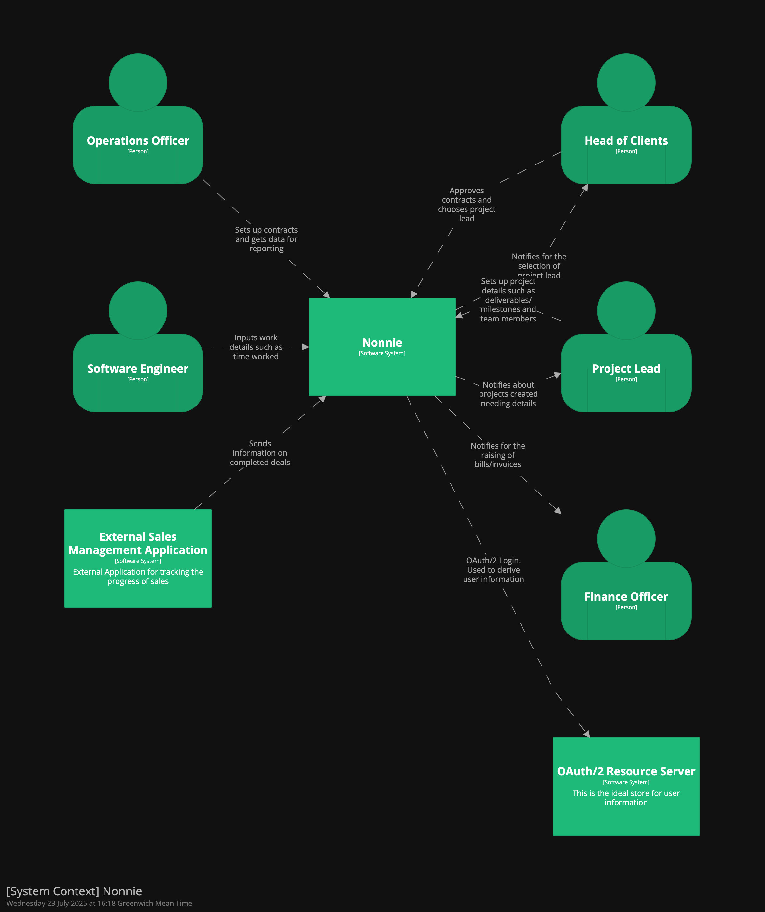
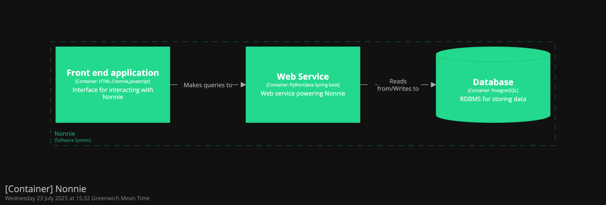
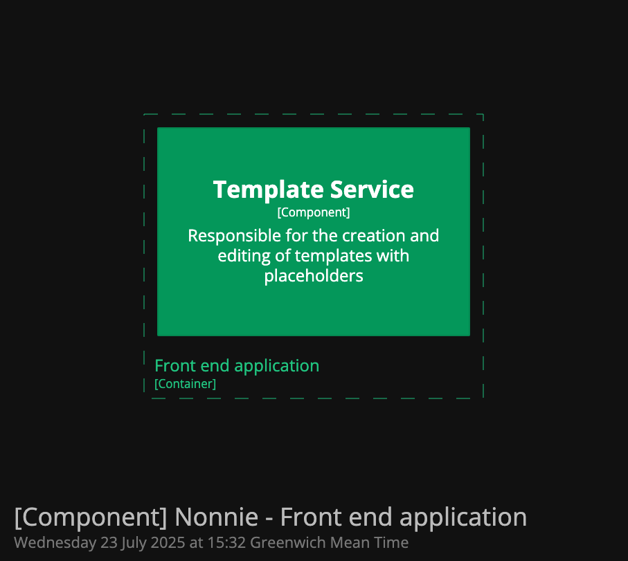
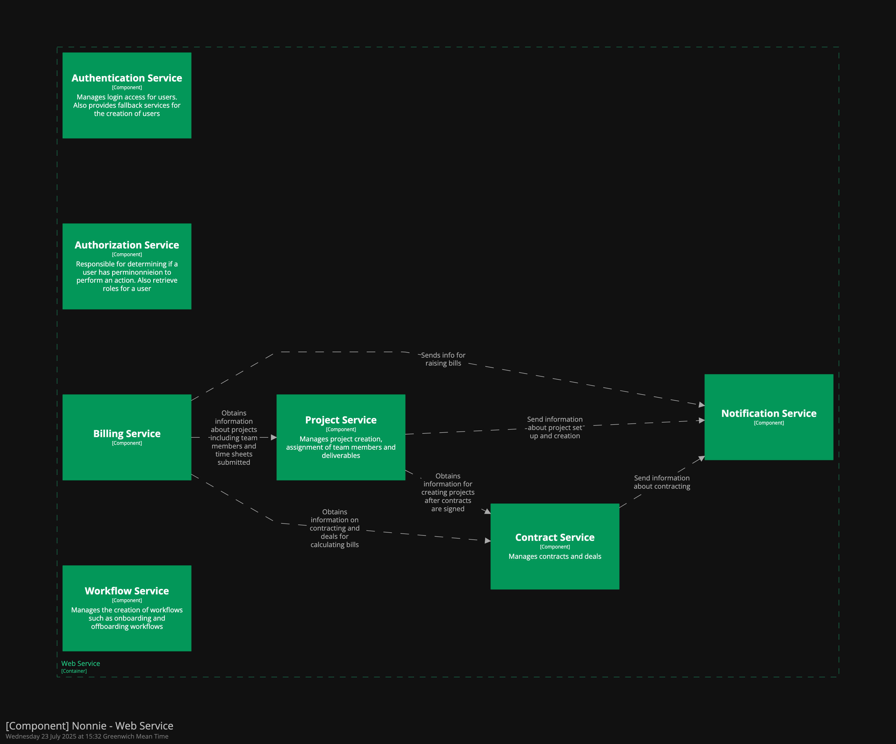

# Nonnie System Design Doc

## Introduction
To provide a contract, project, client and employee management platform to support turntabl operations team adequately manage clients and contracting, project onboarding workflows, resource planning among others and billing computations.

## Requirements
- Functional Requirements
  - Allow the uploading and management of fillable document templates 
  - Generate documents via secure link for digital signing
  - Allow the creation of workflow steps
  - Send email notifications
  - Role based access permissions
  - Integrate with sales applications to identify deals to be processed into contracts
  - Computes billing details based on contract and employee hours
- Non-functional Requirements
  - Application and its data must be secure with role-based access
  - Data durability
  - Accuracy in computations
- Constraints
  - Data is already available to work with Active Campaign
  - Feasibility of digital signing

## Context & Use cases
Below is the list of steps taken and high-level interactions as data flows through the application:
1. Sales team work on and manage in progress deals in Active Campaign. When a deal is successfully closed, it is published, and the team can begin work on contracting and resourcing
2.	If the account for the sale is not present, an operations officer will be able to log in and create the account
3.	Details of the deal are used to fill templates of the client contract. The operations officer may choose any preloaded template suitable. This means beforehand the templates would have been uploaded
4.	After the template is filled in, it is sent for review (some role/permission will be made for this)
5.	Head of clients may add some comments and send it back for updates. At this point some items may need to be updated in Active Campaign as this is the source of truth for deal information
6.	After contract is regenerated with modifications, it is sent back to Head of Clients for another review. Head of clients can mark the contract as approved
7.	Approved contract can now be sent to client for signing. Current plan is to send client a link that allows them to digitally sign a contract and submit. Security and Compliance critical in this step
8.	After contract is marked as signed, a notification is sent to head of clients to create project and choose head of project
9.	Head of Client logs into application, sees signed contract pending project creation and proceeds to create project and choose head of project
10.	Head of project receives notification about project. They log into the application and see the pending project needing to be set up. The head of project begins assembling the team for the project. Conversations may occur offline before the final team is assembled
11.	Once team is assembled, head of project will add the team members to the project and request onboarding to commence
12.	An operations officer is assigned to the onboarding and receives a notification requesting commencing onboarding
13.	Prior to this, the operations officer would have created an onboarding workflow that outlines steps to take and evidence to be submitted. The officer would be able to log into, create the flow and persist this information to be used when responding to an onboarding request
14.	The officer will step through each step in the onboarding flow for each team member. Marking tasks as complete and uploading evidence.
15.	Once onboarding is complete, the developer will be able to see the project when they log in
16.	The developer logs in, can see the project and its details. They can also see and fill a timesheet for the week
17.	Time sheets must be filled and submitted on a weekly basis. Reminders will be sent at intervals if weekly time is not filled. Timesheets can be edited after submission
18.	Time sheets will be used towards billing. Billing will include a charge per frequency (to be decided)
19.	Alternatively, some projects will be based on the submission of deliverables. The operations officer will create these deliverables and attach them to the project. Deliverables may be tied to billing.
20.	As deliverables are met, they are checked off by the lead. These may trigger invoice notifications to finance.
21.	A project lead can also request offboarding of a developer. This would also be assigned to an operations officer who will commence an offboarding workflow
22.	Once that is complete the developer is removed from the project and the related billing steps are taken. Developers are never actually removed from project for historical tracking and auditing
23.	Finance obtains notifications of bills to be raised on projects.

## High Level Architecture

*Nonnie High Level Design showing interactions with persons and external systems*

*Container View showing Nonnie as 3 Tier Architecture*

*Component View showing the Nonnie Web Service and all the services within it*